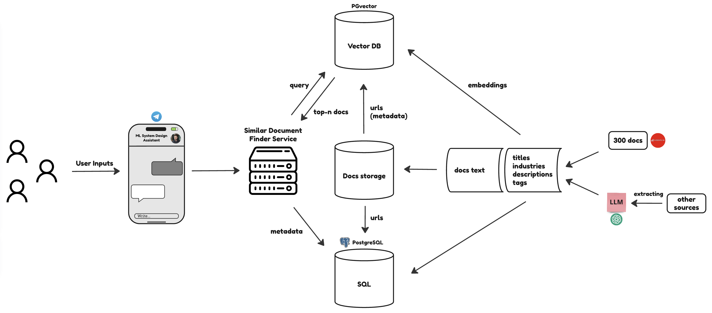

# ML System Design Document - Similar Design Finder Service
## 1. Goals and prerequisites
### 1.1. Business Objectives
This document describes the "Similar Design Finder Service", which is part of a larger project to create an ML System Design Assistant. The main task of this service is to provide the ability to conveniently and quickly search for appropriate examples of documentation on designing machine learning systems (ML System Design Doc, hereinafter referred to as Doc) among hundreds of available options. This will allow users to find relevant examples that best match the specifics and requirements of their projects.

## 1.2. Сoncept of the result
The upper-level scheme. For a more detailed scheme of work, look at the item “Baseline”.

## 1.3. Existing flow analysis
At the moment, finding the appropriate Doc requires significant effort: users must independently analyze over 300 examples scattered across various sources. This process is not only cumbersome but also highly inefficient, as a lot of time is spent on the initial selection and analysis of documents.

## 1.4. Advantages of using ML
The implementation of the "Similar Design Finder Service" will automate the process of searching and analyzing Docs, making it significantly more convenient and faster. The service will use machine learning algorithms to analyze user queries and find the most suitable documents in a unified database. Users will have the opportunity to efficiently explore good examples of Docs, such as those presented on [Evidently AI](https://www.evidentlyai.com/ml-system-design) and in the [MLSystemDesign repository on GitHub](https://github.com/ML-SystemDesign/MLSystemDesign), which will speed up the design process and improve the quality of machine learning system development.

## 1.5. Estimated Costs
Our infrastructure budget is $100 per month. This amount includes the rental of: databases and server hosting.

## 1.6. Business requirements and restrictions
### 1.6.1. Business requirements
**Accessibility**: The service will be provided as a Telegram bot.
**Accuracy**: The bot must provide accurate (according to a specific metric defined in a subsequent chapter) and relevant results for user search queries.

### 1.6.2. Business restrictions
**Timeline**: The first version of the bot must be launched into production within three months.

### 1.6.3. MVP integration steps
* **Search Algorithm Development**: Creation of an algorithm to match user queries with a database of design documents to find the most relevant document.
* **Data Collection and Storage Organization**: Information describing document entities will be stored in .json format.
* **Telegram Bot Interface Development**: Implementation of a functional interface for user interaction with the bot.
* **Testing and Optimization**: Conducting tests on the bot to ensure its reliability and ease of use.

### 1.6.4. MVP Success criteria
* **Search Functionality**: The bot should accurately and quickly respond to queries, providing relevant design documents.
* **Response Time**: The bot should process requests and display results within 3-5 seconds.
* **User Satisfaction**: Positive feedback from users regarding the ease of use and usefulness of the bot.
* **Operational Reliability**: The bot should operate reliably in test mode, minimizing failures and errors.

## 1.7. Project Scope and Exclusions
### 1.7.1. Scope
* Development and implementation of the Telegram bot "Similar Design Finder Service", which allows users to find design documents that match their query using machine learning algorithms.
* Creation of a search algorithm to analyze and match user queries with a database of design documents.
Organization of data storage describing design documents.
* Development of a user interface to ensure easy and intuitive interaction with the bot.
* Testing and optimization of the bot to ensure its reliability and effectiveness.

### 1.7.2. Exclusions: 
Implementation of services: Key Idea Extraction + Similar Design Finder,  Step-by-Step One-Pager Creator, Detailed Design Document Validator, Automated Detailed Design Document Creator, Interview and Validation Service.

# 2. Methodology
## 2.1. Defining the Problem
The main problem that we are trying to solve is the search for a ready-made (successful?) ml-system design at the user’s request. To put it simply, something like Google is in the domain of ready-made ML-system design documents. In technical terms, this problem is called information retrieval.
Typically, the solution to this problem consists of three components:
* **Indexing** - extracting features from data and storing them in a database
* **Ranking**  - sorting the indexed data based on the relevance to the user’s query
* **Retrieval** - presenting the highest-ranking documents to the user

Each of the components has several solutions. For example, an inverted index is one of the most frequently used indexes in search engines such as Solr (Lucene) or ElasticSearch. An index is a data structure that, for each word, contains a list of documents in which the word appears. Using this, you can find documents that contain most of the words from the user query. However, this method has a significant drawback - the inability to find documents that are semantically close to the user's request. Because of this, we may be missing some documents that the user might be interested in. Another more modern approach is vector indexes. It uses an encoder that turns a text document into an embedding and stores it in a vector database. Thanks to this construction, it becomes possible to search in vector space for vectors that are close to some extent, which are expected to be semantically close in meaning to each other.
The ranking problem can also be solved in different ways, each of which has its advantages and disadvantages; let’s present some of them:
* Keyword search
* TF-IDF
* BM25
* Hybrid (keyword + semantic) 

## 2.2. Choosing metrics
### 2.2.1. Offline metrics
* Recall@K - true positive@k/ (true positive@k + false negative @k)
* Precision@K - true positive@k/ (true positive@k + false positive @k) 
* MAP@K - 1/U  * Uu=1AP@Ku  
* Precision - true positive/ (true positive + false positive) 
* Precision (by tags). Expected value: 0.9
* Precision (by LLM). Expected value: 0.7

### 2.2.2. Online metrics
* Visited - Number of users who visited the telegram bot
* Submitted - Number of users who submit prompts
* Viewed - Number of users who view the response
* Clicks - Number of Users who click on provided recommendation links 
* DAU/WAU/MAU - daily/weekly/monthly active users
* User return rate - Percentage of users who used the telegram bot in the previous week/month and continue to use it in the current week/month
* Zero result rate (ZRR) - the ratio of answers from telegram bot with zero provided documents

### 2.2.3. Business metrics (should we specify them on this step?)

### 2.2.4. Technical metrics
* Latency - the average response time to a user’s request
* Throughput (RPS) - the number of requests processed per second
* Reliability - the percentage of successful requests compared to the total requests

## 2.3. Defining Objects and Targets

## 2.4. Data collection.
As an initial batch of training data, we are planning to use the popular sources of successful ML system design implementations. 
Sources:
	https://www.evidentlyai.com/ml-system-design

As an option, if the user wants to provide some sources of the ml-system-design example, then he can send it through the telegram bot. After the manual view, this source can be added to the database or not.

## 2.5. Data preparation.
The available data should be divided into smaller parts (chunks) which is a crucial step as well. The need for this step is the context size limit of the selected encoders. The strategy should be as smart as possible to ensure the adjacent information isn’t split between the chunks.

## 2.6. Error analysis
This step we can divide into two parts:
* During the offline phase
* During the online phase

In the case of the offline phase, we can compare the different algorithms based on the metrics on the test set. The test set should be as representative as it can be. Comparing the current iteration with the previous one allows us to understand whether the direction of changes is correct or not.
In the case of the online phase, we can analyze the logs of the users’ interactions. For example, some of the users can face problems when they don’t get the relevant documents because of the low quality of the system or no documents related to this query in the database.  Analyzing the logs we can mark such problematic queries and tune the system to enhance the user experience. 

# 3. Pilot Training
## 3.1. Solution ML Architecture
### 3.1.1. Baseline
The architecture for the Similar Design Finder Service will start with a baseline solution that uses a straightforward but effective vector space model. This model will utilize a pre-trained BERT encoder to vectorize titles, short descriptions, and tags of the ML System Design Docs. These vector representations will capture the semantic meanings and support efficient similarity searches, which are crucial given the modest dataset size of over 300 documents. This approach minimizes the need for extensive custom model training and updates. The initial setup includes:
* **Vectorization**: Encoding documents with BERT to convert text into high-dimensional vectors.
* **Indexing**: Storing these vectors in a high-performance search index to enable fast retrieval. 

### 3.1.2. Enhancements Post-Baseline
To improve upon the baseline model, we can pursue several strategies:
* **Expanding Vectorization**:
    * Extend the scope of vectorization to include summarizations generated by large language models (LLMs) for each document.
    * Utilize text processing models like Longformer, which are adept at handling longer texts. This would allow us to capture more comprehensive semantics of entire documents.
* **Fine-tuning BERT**: Adapt the BERT model specifically to the domain of ML System Design Docs by further training it on a curated subset of these documents.
* **Result Re-ranking**: Implement a re-ranking mechanism to refine the initial search results and ensure that the most relevant documents are prioritized in the final output.
* **Semantic Search Enhancement**: Employ more sophisticated similarity measures and integrate clustering techniques to refine search results. This will enhance the system's ability to group similar documents more effectively.

This architecture strategy starts with a simple, robust baseline and plans for iterative enhancements. The goal is to balance performance with practicality, ensuring that the system remains scalable and can adapt to both user needs and dataset expansions.

## 3.2. Pre-Launch Quality Assurance
Before presenting the Similar Design Doc Finder Service to pilot users, we ensure the system's ability to accurately match user queries with relevant system design documents. To assess the readiness of our system for initial user exposure, we have established the following internal quality benchmarks:
* **Tag Precision**: 
    * Our service must demonstrate at least 90% precision in correctly tagging design documents. This metric verifies that the system can appropriately categorize documents based on predefined tags in our database of 300 labeled documents. For instance, a user request for "a recommendation system for music streaming" should return a document tagged with "recommender system."
* **LLM Relevance Scoring**: 
    * The system should achieve at least 70% relevance scoring from a Language Model (LLM) evaluation. This involves presenting both the user's query and the retrieved document to the LLM, which then assesses the relevance of the document to the query. This measure ensures the system's effectiveness in fetching documents that are contextually appropriate to the user's needs.
* **Team Validation**: 
    * Before release, there must be agreement among all team members that the system outputs are reliable and relevant. This consensus will be reached through hands-on testing by the team, ensuring that the system meets our standards and behaves as expected in real-world scenarios.

## 3.3. Pilot Evaluation Method
To evaluate the effectiveness of the pilot, we will use a combination of qualitative and quantitative methods. We will track metrics such as precision, recall, and user satisfaction ratings to assess the relevance of the documents returned by the system. Qualitative feedback will also be gathered through user surveys and interviews, focusing on the usability and helpfulness of the bot in finding appropriate design documents.

## 3.4. Criteria for a Successful Pilot.
The pilot will be considered successful if it meets the following criteria:

* **Precision and Recall**: At least 80% precision and 70% recall in retrieving relevant documents.
* **Response Time**: System responses must be generated within 3-5 seconds.
* **User Satisfaction**: Over 75% of pilot users should report satisfaction with the functionality and results of the bot.

## 3.5. Infrastructure and Scalability Details
Given the manageable size of the dataset, the pilot phase will use a cloud-based virtual machine to host the database and the ML models. This setup ensures that the system is both scalable and capable of handling increases in data volume and user requests as the service expands.

## 3.6. Monitoring
Monitoring will focus on system performance and reliability. Metrics such as query response time, system uptime, and error rates will be continuously monitored. Anomaly detection will be set up to alert the team to any unusual behavior or potential system failures.

## 3.7. Requirements for the operation of the system.
Operational requirements include:
* Daily data backups to prevent data loss.
* User support system to handle inquiries and problems reported by users.

## 3.8. System security.
### 3.8.1. Data Encryption 
We'll use HTTPS for secure data transmission and encrypt stored data to prevent unauthorized access.

### 3.8.2. Authentication and Access Controls 
Access to administrative functions will be restricted to authorized personnel through strong authentication measures.

### 3.8.3. Credential Security
Sensitive credentials will not be stored openly in code repositories. We will use environment variables and secure secrets management tools to handle credentials safely

## 3.9. Risks
### 3.9.1. Data Quality
* **Issue**: Inaccurate or incomplete document metadata can significantly reduce the effectiveness of search algorithms, leading to irrelevant search results.
* **Preventive Actions**: Implement strict data validation procedures when entering data into the system and use data cleansing methods to improve the quality of existing information.

### 3.9.2. Model Overfitting
* **Issue**: Given the small dataset size, there is a risk that the model could overfit to the pilot data, resulting in poor generalization on new data.
* **Preventive Actions**: Employ regularization techniques, conduct cross-validation, and possibly utilize data augmentation methods, such as synthetic data generation, as previously discussed.

### 3.9.3. User Engagement
* **Issue**: There is a risk that the system may not be as engaging for users as expected, leading to lower activity and feedback than anticipated.
* **Preventive Actions**: Develop an interactive and intuitive user interface, and regularly update content and features based on user feedback.

### 3.9.4. System Performance and Scalability
* **Issue**: As the user base and data volume grow, there could be challenges with system performance and scalability.
* **Preventive Actions**: Use scalable cloud infrastructure, optimize search algorithms and databases to handle large volumes of data efficiently.

### 3.9.5. Technical Issues and Bugs
* **Issue**: Potential technical glitches and software bugs could negatively impact system operations during the pilot phase.
* **Preventive Actions**: Conduct thorough testing before launch, including unit testing, integration tests, and stress tests, and set up monitoring systems to quickly identify and fix bugs.

# 4. Pilot implementation.
## 4.1. MVP Implementation Phases
The pilot implementation will involve a limited release to a small group of users for testing and feedback. This will allow us to assess the performance and usability of the service in a real-world setting before a full-scale launch.

### 4.1.1. Prototyping and preliminary experiment.
Develop a basic version of the search algorithm:
* Implement a baseline that can match user queries with design documents based on keywords, titles, or other relevant metadata.
* Conduct preliminary experiments with a limited dataset. For the baseline a set of design documents can be selected to represent the types of documents that users will be searching for.
* Test the basic search algorithm with a limited set of design documents.
* Evaluate the algorithm's performance using metrics from 2.2.

Gather initial feedback from a small group of users:
* Recruit a small group of users to test the initial version of the Telegram bot. 
* Collect feedback on the bot's interface, search capabilities, and overall user experience.

Refine the bot's interface and search capabilities:
* Analyze the feedback from the initial user group and identify areas for improvement.
* Update the search algorithm and interface to address any issues or limitations identified during the preliminary experiment.

### 4.1.2. Scaling based on experimental data.
Expand the dataset and improve the search algorithm:

* Incorporate a larger number of design documents into the system, covering various industries, use cases, and ML techniques.
* Implement a more advanced search algorithm that has the capability to include summaries in the search output.
* Evaluate the algorithm's performance using metrics from 2.2.

At this stage, it is necessary to optimize the system's architecture and infrastructure to support a larger volume of data and user requests. One potential solution is to deploy the bot within a cloud infrastructure, which offers flexibility in resource management, scalability, and ensures high availability.

### 4.1.3. Testing
Conduct thorough testing of the bot's functionality:
* Perform unit tests to validate individual components and functions of the search algorithm and interface.
* Execute integration tests to ensure that the different components of the system work together seamlessly.
* Carry out end-to-end tests to simulate real-world user scenarios and validate the system's overall performance.

Address any identified issues and optimize the system for better performance:
* Debug and fix any issues or bugs that arise during the testing process.
* Optimize the system's performance by fine-tuning algorithms, improving caching strategies, or upgrading infrastructure as needed.

Perform user acceptance testing:
* Recruit a larger group of users to test the updated version of the Telegram bot.
* Implement feedback collection mechanisms, such as in-app surveys, user interviews, or feedback forms.
* Collect feedback on the bot's functionality, accuracy, and user experience.
* Address any remaining issues or concerns before launching the MVP.

If the system meets the criteria from 3.3, then proceed to MVP Launch.

### 4.1.4. MVP Launch
Deploy the MVP version to production:
* Set up the necessary infrastructure and resources to host the bot and its associated data.
* Configure monitoring and logging tools to track the bot's performance and user engagement.
* Quickly respond to and resolve any critical issues or bugs that users may encounter while using the bot.
* Continuously improve the system based on user feedback and performance metrics.

### 4.1.5. Analysis feedback
Analyze the feedback to identify areas for improvement and potential new features:
* Categorize and prioritize user feedback based on its impact on the bot's functionality, accuracy, and user experience.
* Identify potential new features or enhancements that can address user needs and improve the bot's overall value proposition.

By continuously analyzing user feedback and performance metrics, the system can be iteratively improved and updated to enhance its functionality, accuracy, and overall user experience.
